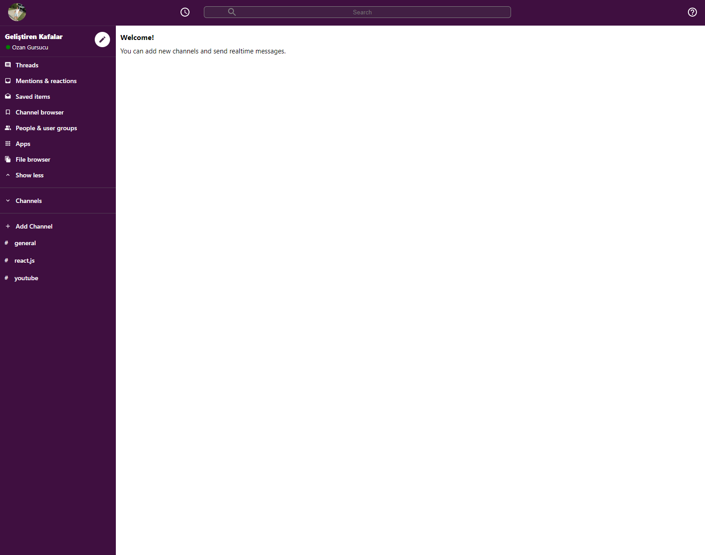

# Slack-Clone

You can log in with your google account, create new channels and send real-time messages.

Click demo to try it by yourself!

## Slack-Clone Demo Link

You can view the site here
[Click Me](https://slack-clone-ozngrsc.web.app/)

## Topics

- ReactJS
- React Context API -Redux
- Material UI
- React Hooks
- Flexbox
- Firebase's Firestore realtime Database
- Firebase Google Authentication (Full Login)
- React Flip Move
- Responsive Design
- Deploy the App LIVE on Firebase

## Author

Ozan Gürsucu (ozngrsc)

